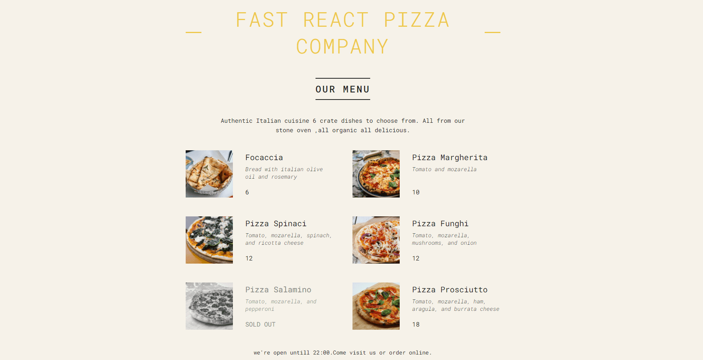

# Pizza Menu

<div align="center" >


</div>

<p>Pizza Menu</p>

<p>
  
  
  
</p>

<br>

<br>

## Tecnologias e Ferramentas

As seguintes tecnologias foram utilizadas no desenvolvimento do projeto:

- [HTML](https://devdocs.io/html/)
- [CSS](https://devdocs.io/css/)
- [JavaScript](https://devdocs.io/javascript/)
- [React Js](https://devdocs.io/Reactjs/)
- [styled-components](https://devdocs.io/styled-components/)

<br>

## Design

O design da pagina é feito de cores que leves que atraem o público.

<br>

## Instalação e Uso

Para rodar a aplicação, você precisa instalar o [Node](https://nodejs.org/en/)

Siga os passos abaixo:

```bash
# Abra um terminal e copie este repositório com o comando
$ git clone https://github.com/felipesilv4dev/pizza.git
# ou use a opção de download.

# Entre na pasta com
$ cd PIZZA-MENU

# Instale as dependências
$ npm install

# Rode a aplicação
$ npm run dev
```

<br>

Feito com :yellow_heart: by [Felipe_Silva](https://github.com/felipeSilv4dev)

 <div align="start">
  <a href='http://www.linkedin.com/in/felipe-silva-1019ab271' target'_blank'>
  <a href="mailto:felipesantana18n@gmail.com" target='_blank'> </a>
</div>
